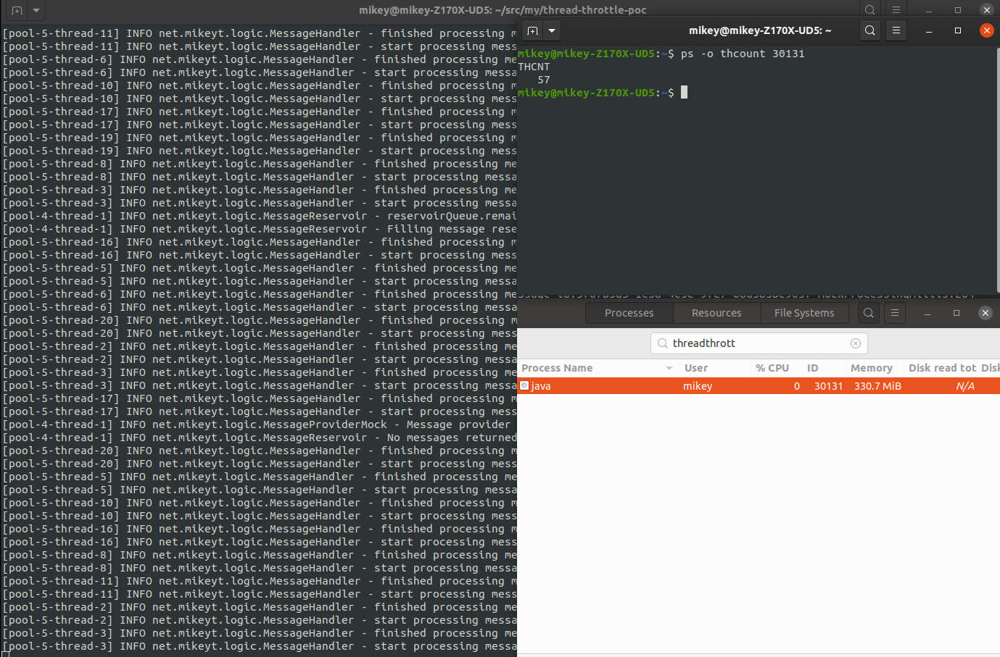

# thread-throttle-poc

This is a proof of concept for throttling batch message processing of an external message queue.

TODO:

* Add stats counters/output
* Add exception handling
  * Investigate need for loop restarts on fatal exceptions outside of message handling
* Add visibility timeout refresh functionality
  * Investigate batch vs individual message feasibility/complexity

### How to Run

In root directory:

`mvn compile`

`mvn exec:java`

### Options

Alter runtime options in `QueueOptions.java` (recompile before re-running). JVM options can be modified in `.mvn/jvm.config`.

### Misc

Check number of theads currently in use by searching for process "ThreadThrottlePOC", getting process ID and plugging it the `ps` command:

`ps -o thcount <process-id>`

## Screenshot

[2020-04-18-ThreadThrottlePOC-demo-01.png]
